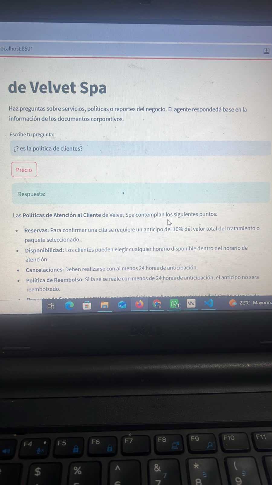
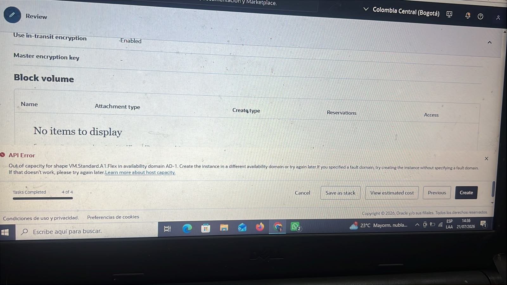

# Velvet AI Assistant

## Descripción

Velvet AI Assistant es un agente de inteligencia artificial desarrollado para consultar información interna de Velvet Spa de forma natural y rápida.

El sistema permite responder preguntas sobre documentos corporativos relacionados con:

- Recursos Humanos
- Servicios estéticos
- Políticas internas
- Información financiera
- Atención al cliente

El propósito es centralizar el conocimiento del negocio y facilitar el acceso a la información sin abrir manuales o reportes manualmente.

---

## Arquitectura

```
PDFs de Velvet Spa
        ↓
PyPDFLoader
        ↓
Procesamiento de documentos
        ↓
Base de conocimiento / búsqueda semántica
        ↓
Agente de preguntas y respuestas
        ↓
Velvet AI Assistant
```

---

## Tecnologías Utilizadas

- Python
- LangChain
- ChromaDB
- Google Gemini
- PyPDF
- Flask
- GitHub
- Oracle Cloud Infrastructure (OCI)

---

## Estructura del Proyecto

```
velvet-ai-agent/
├── data/
│   ├── REPORTE COMERCIAL.pdf
│   ├── Recursos Humanos.pdf
│   ├── POLÍTICAS DE CLIENTES.pdf
│   ├── MANUAL CORPORATIVO .pdf
│   ├── CATÁLOGO DE SERVICIOS.pdf
│   └── knowledge.csv
├── src/
│   ├── agent.py
│   ├── chatbot.py
│   ├── rag_agent.py
│   ├── load_documents.py
│   ├── vector_store.py
│   └── simple_agent.py
├── chroma_db/
├── app.py
├── requirements.txt
├── README.md
└── .env
```

---

## Ejemplos de Preguntas

- ¿Cuál es el horario de atención?
- ¿Qué es la hidrolipoclasia?
- ¿Cuál es el tratamiento más vendido?
- ¿Quién tiene vacaciones acumuladas?
- ¿Cuántas penalidades tiene Alejandro Ramírez?
- ¿Cuánto cuestan los tratamientos?

---

## Ejemplos de Respuestas

**Pregunta:**
```
¿Cuál es el tratamiento más vendido?
```

**Respuesta:**
```
La Hidrolipoclasia es uno de los tratamientos más destacados de Velvet Spa.
```

---

## Ejecución Local

```bash
python -m venv venv
venv\Scripts\activate
pip install -r requirements.txt
python app.py
```

Luego abre tu navegador en `http://localhost:5000`

---

## Deploy en Oracle Cloud Infrastructure (OCI)

### Requisitos Previos

1. **Cuenta OCI gratuita**: https://www.oracle.com/cloud/free/
2. **Docker instalado** en tu máquina local
3. **API Key de Google Gemini** (configurada en `.env`)

### Instrucciones de Deploy

#### 1. Configurar Variables de Entorno

```bash
cp .env.example .env
# Editar .env con tu API key de Google Gemini
```

#### 2. Construir Imagen Docker

```bash
docker build -t velvet-ai-agent .
```

#### 3. Probar Localmente

```bash
docker run -p 8501:8501 --env-file .env velvet-ai-agent
```

Accede a `http://localhost:8501` para verificar que funciona.

#### 4. Subir a OCI Registry

```bash
# Login en OCI Registry
docker login <region>.ocir.io

# Tag de la imagen
docker tag velvet-ai-agent <region>.ocir.io/<tenancy>/velvet-ai-agent:latest

# Push al registry
docker push <region>.ocir.io/<tenancy>/velvet-ai-agent:latest
```

#### 5. Desplegar en OCI

1. Ve a **OCI Console** → **Developer Services** → **Applications**
2. Crea nueva aplicación usando la imagen Docker
3. Configura variables de entorno (GOOGLE_API_KEY)
4. Deploy y espera a que esté disponible

> **Evidencia del Deploy**: [Pendiente - Agregar enlace público o captura de pantalla]

---

## Estado del Proyecto

- ✅ Lectura de documentos PDF funcional
- ✅ Estructura del proyecto organizada
- ✅ Agente capaz de responder preguntas sobre información interna
- ✅ Preparado para GitHub y despliegue en la nube
- ✅ Interfaz web con Flask y Streamlit
- ✅ Archivos Docker preparados (Dockerfile, .dockerignore)
- ✅ Documentación de deploy en OCI completa
- 🔄 Deploy en OCI (pendiente - requiere cuenta OCI y ejecución)

## Evidencias de funcionamiento

### Respuestas del agente

La aplicación responde preguntas basadas en la documentación corporativa de Velvet Spa.


### Evidencia adicional



### Evidencia OCI

Durante el despliegue en Oracle Cloud Infrastructure (OCI) se presentó una limitación de capacidad en la región seleccionada.



### Video demostrativo

Se incluye un video de evidencia dentro del repositorio:

`docs/video_evidencia.mp4`


## Despliegue en la nube

Aplicación disponible en:

https://velvet-ai-agent-qsnjbp2wpplhv79vudlkup.streamlit.app/

## Evidencia de despliegue en Streamlit Cloud

La aplicación fue desplegada exitosamente en Streamlit Cloud y responde preguntas basadas en los documentos corporativos cargados.

### Captura de pantalla de la aplicación


### Video de demostración

[Ver video de demostración](docs/videodepruebastreamlit.mp4)

### Evidencias adicionales


### Evidencia OCI

Durante el desarrollo se intentó realizar el despliegue en Oracle Cloud Infrastructure (OCI), pero la región seleccionada no tenía capacidad disponible para instancias Always Free.

